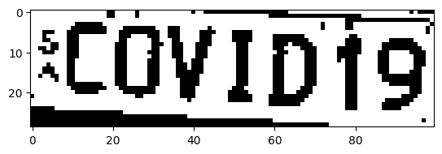

# License Plate Extraction & Image Processing

A computer vision project focused on digital image processing techniques to detect, isolate, and binarize vehicle license plates using Python. The entire pipeline is built and documented in a Jupyter Notebook, demonstrating core image manipulation methods.

## 🔧 Tech Stack
* **Language:** Python (Jupyter Notebook)
* **Computer Vision:** OpenCV (`cv2`), Imutils
* **Data & Visualization:** NumPy, Matplotlib

## 🏃 How to Run

1. Clone this repository:
   ```bash
     git clone https://github.com/AlexMagno757/license-plate-recognition.git
   ```

2. Install the required dependencies:
   ```bash
   pip install opencv-python matplotlib numpy imutils
   ```

3. Open the Jupyter Notebook:
   ```bash
   jupyter notebook
   ```

4. Place your test image in the root directory (e.g., `image1.jpg`), update the file path in the first cell, and run the blocks sequentially.

## 📊 Results

| Original Image | Detected Plate & Text |
| :---: | :---: |
|  |  |
